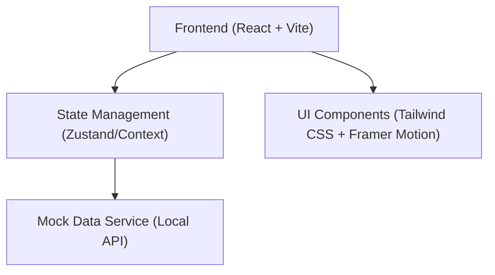
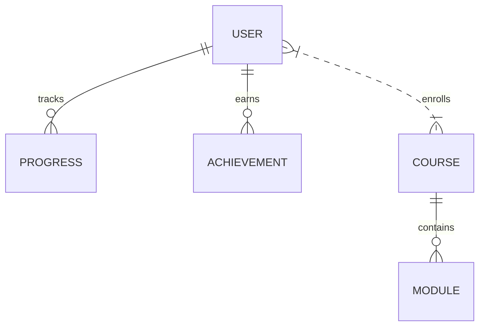

## 1. Architecture Design


## 2. Technology Description
- Frontend: React@18 + tailwindcss@3 + vite
- Routing: react-router-dom
- Animation: framer-motion
- Icons: lucide-react
- Initialization Tool: vite

## 3. Route Definitions
| Route | Purpose |
|-------|---------|
| / | Landing page |
| /dashboard | User progress and personalized path |
| /courses | Course catalog and leveled selection |
| /learn/:courseId | Interactive learning module (vocab, grammar, listening) |
| /community | Forums and leaderboards |

## 4. API Definitions (Mock API)
```typescript
interface UserProfile {
  id: string;
  name: string;
  targetLanguage: string;
  level: string;
  xp: number;
  badges: string[];
}

interface Course {
  id: string;
  title: string;
  language: string;
  level: string;
  modules: string[]; // vocab, grammar, etc.
}
```

## 5. Data Model
### 5.1 Data Model Definition

