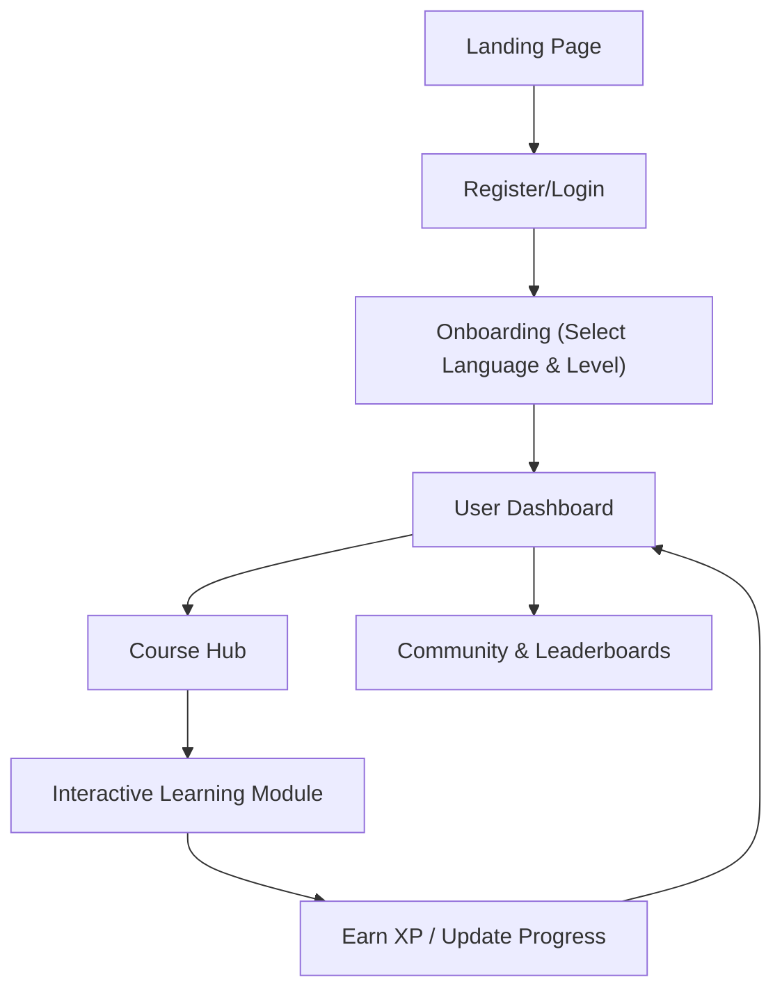

## 1. Product Overview
LinguaLearn is an immersive, multi-language online education platform supporting English, Japanese, Korean, and other mainstream languages. It aims to provide a comprehensive learning experience through leveled courses, interactive modules, progress tracking, personalized recommendations, and a vibrant community.

## 2. Core Features

### 2.1 User Roles
| Role | Registration Method | Core Permissions |
|------|---------------------|------------------|
| Learner | Email / Social Login | Access courses, track progress, participate in community, earn achievements |
| Admin | Internal creation | Manage content, users, and community moderation |

### 2.2 Feature Module
1. **Landing Page**: Hero section, platform benefits, language options, testimonials.
2. **Dashboard**: Learning progress overview, daily goals, recommended paths, recent achievements.
3. **Course Hub**: Leveled course catalog, language selection, course details.
4. **Learning Module**: Interactive exercises (vocabulary memorization, grammar, oral shadowing, listening training).
5. **Community**: Forums, leaderboards, user posts, achievement showcases.

### 2.3 Page Details
| Page Name | Module Name | Feature description |
|-----------|-------------|---------------------|
| Landing Page | Hero Section | Compelling call-to-action, dynamic typography, language selection preview |
| Dashboard | Progress Tracker | Visual charts for learning streaks, vocab learned, and next recommended lesson |
| Course Player | Interactive UI | Split screen for media/audio and exercises, real-time feedback for shadowing |
| Community | Leaderboard | Ranking users by weekly XP, showcasing badges and recent milestones |

## 3. Core Process
The user registers, selects a target language, takes a placement test (or selects a level), and starts their personalized learning path. They interact with modules, earn XP/badges, and engage with the community.

## 4. User Interface Design
### 4.1 Design Style
- Primary Colors: Vibrant Indigo and Soft Coral for accents.
- Background: Clean, modern off-white with subtle gradients or noise textures to add depth.
- Button Style: Pill-shaped, smooth hover transitions, slight drop shadow for primary actions.
- Font: Modern, geometric sans-serif (e.g., Plus Jakarta Sans or Outfit) paired with a highly readable body font (e.g., Inter).
- Layout Style: Card-based dashboard with generous padding, asymmetrical elements for visual interest, sticky sidebars.
- Icon/emoji: Playful, flat 3D icons or high-quality vector illustrations.

### 4.2 Page Design Overview
| Page Name | Module Name | UI Elements |
|-----------|-------------|-------------|
| Dashboard | Progress Card | Glassmorphism effects, vibrant progress rings, soft typography |
| Learning | Exercise View | Minimalist distraction-free layout, large typography for vocab, audio visualizers |

### 4.3 Responsiveness
Desktop-first approach with fluid grids adapting to mobile screens. Touch-optimized buttons and swipe gestures for the learning modules on mobile devices.
